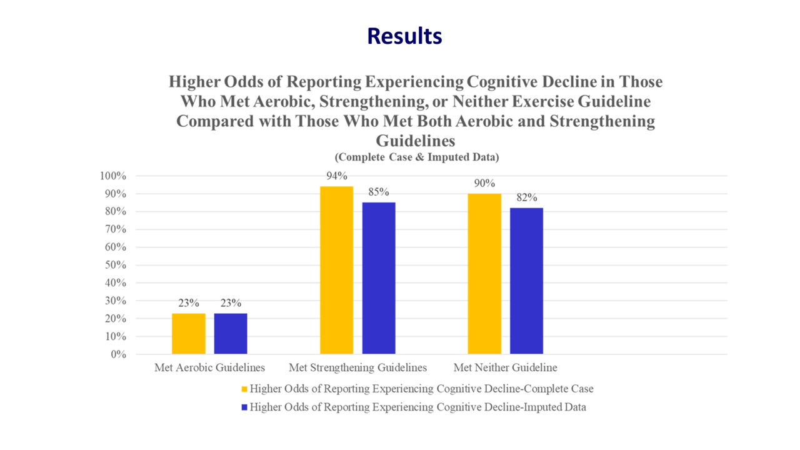
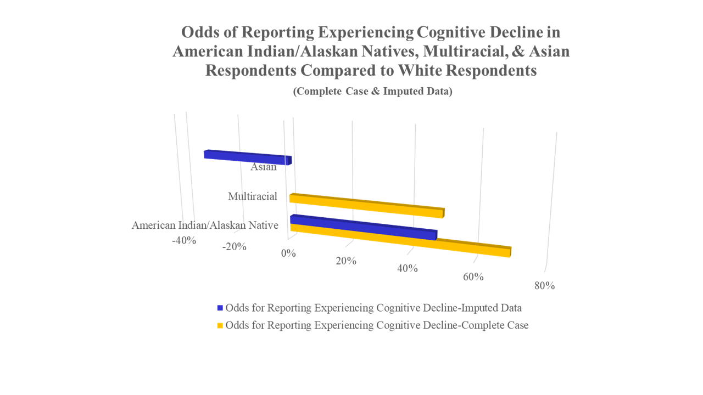
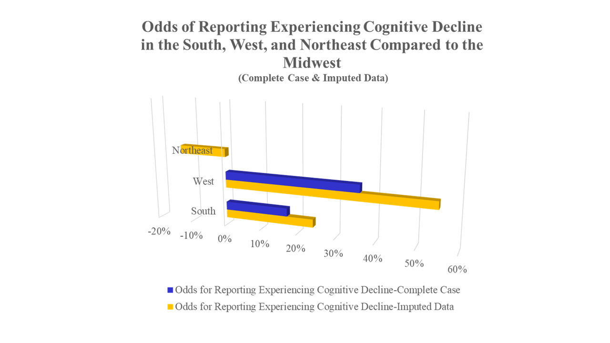
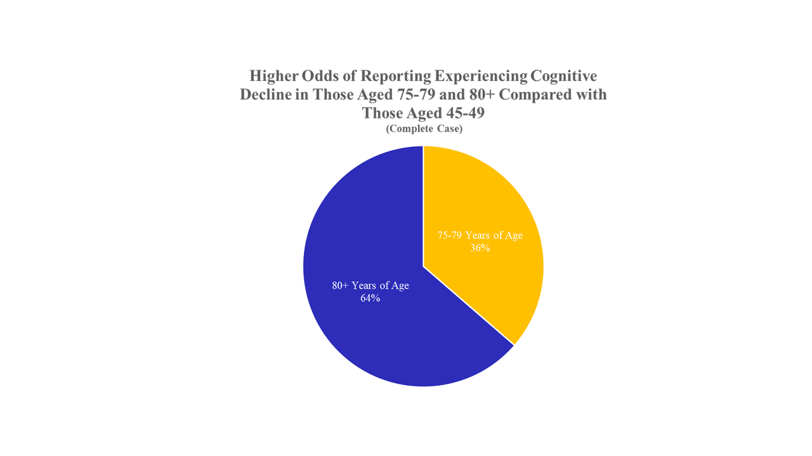
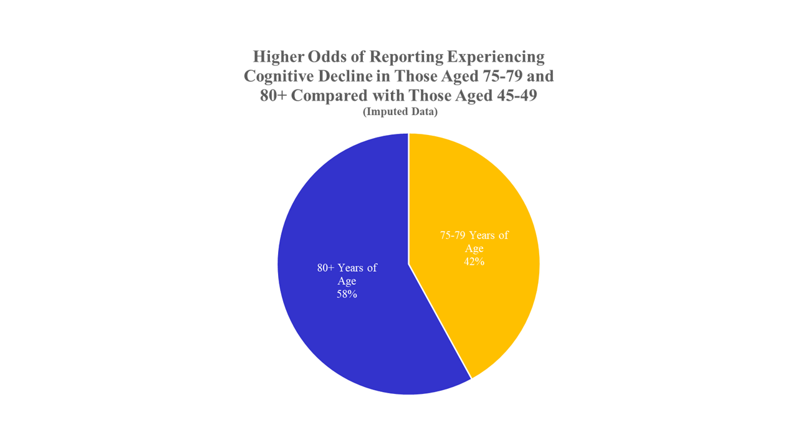

# Abstract

Cognitive decline problematically affects nearly 6.2 million individuals living in the United States (Alzheimer’s Association, 2021). This astounding number is expected to grow exponentially to nearly 14 million in the next 40 years (Alzheimer’s Association, 2021). The economic, physical, and emotional toll generated by this disorder is staggering. Markedly, while older Americans are the demographic most likely to experience cognitive decline, it is not considered an unavoidable effect of aging (World Health Organization, 2020). With this in mind, it is imperative to find ways to mitigate and/or eliminate the spread of this condition. Numerous studies have shown that lifestyle factors can help maintain cognitive health. Consuming nutrient-dense foods, such as fruits and vegetables, and participating in regular, intentional physical activity have been reported to reduce the risk of cognitive impairment. The current study utilized 2019 Behavioral Risk Factor Surveillance System (BRFSS) data to examine the relationship between subjective cognitive decline and levels of nutrition and exercise while controlling for demographic covariates. Due to missing data, analysis was run with both complete case data and imputed data. While the results differed between the two analyses, it was decided that the  imputed results yielded a more accurate assessment as more data were employed. Results from the imputed data suggest that higher levels of fruit or vegetable consumption, as well as elevated levels of purposeful physical activity, are associated with lower reports of experiencing cognitive decline. These findings may indicate the need for public health programs that promote healthy lifestyle factors to support cognitive health.

## R Code

You can explore the R code for the analysis here: [cognitive_decline_analysis.R](https://github.com/Carley589/Exercise-Nutrition-Cognitive-Decline/blob/main/cognitive_decline_analysis.R)

## Slides

